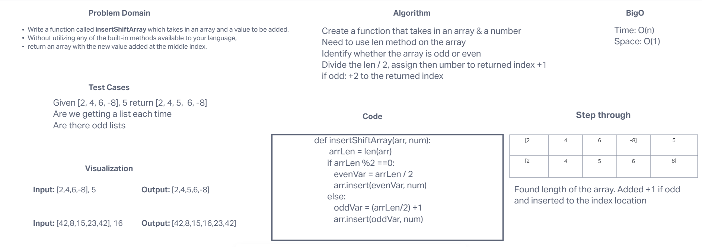

# Challenge Title
<!-- Description of the challenge -->
Write a function called insertShiftArray which takes in an array and a value to be added. Without utilizing any of the built-in methods available to your language, return an array with the new value added at the middle index.
## Whiteboard Process
<!-- Embedded whiteboard image -->

## Approach & Efficiency
<!-- What approach did you take? Why? What is the Big O space/time for this approach? -->
Time: O(n), Space: O(1)
## Solution
<!-- Show how to run your code, and examples of it in action -->
def insertShiftArray(arr, num):

		 arrLen = len(arr)
		if arrLen %2 ==0:
      		evenVar = arrLen / 2
		 	arr.insert(evenVar, num)
  		else:
			oddVar = (arrLen/2) +1
 			arr.insert(oddVar, num)
