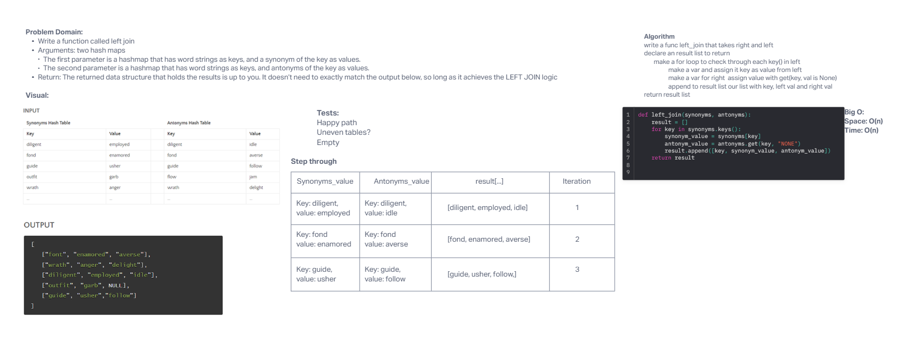

## Authors
Slava Makeev, GPT

# Challenge Title
hashtable_left_join

## Whiteboard Process

## Approach & Efficiency
BIG O:
Time: O(n^2)
Space O(n)

## Tests
Requires installed pytest library.
run pytest <filepath> to run tests.

Target file is hashtable_left_join inside code_challenges
