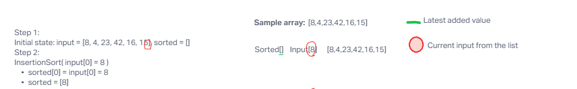
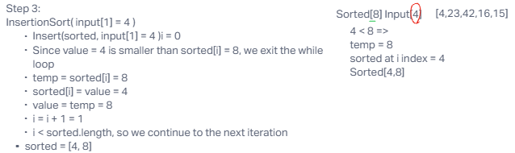
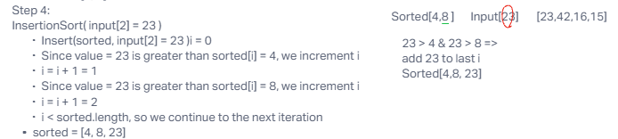
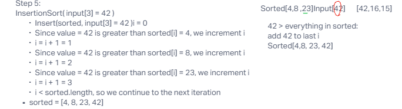
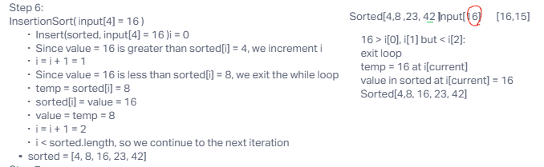
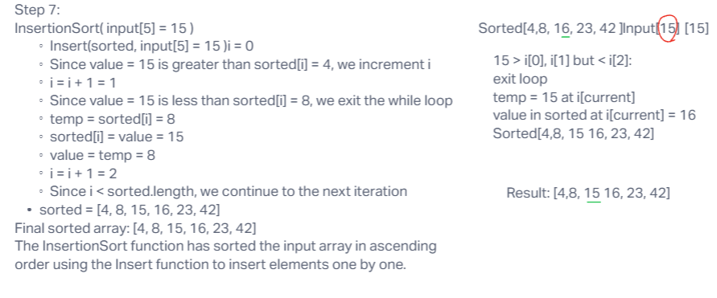

** Selection sort

Step 1:

Initial state: input = [8, 4, 23, 42, 16, 15], sorted = []

Step 2:

InsertionSort( input[0] = 8 )

sorted[0] = input[0] = 8
sorted = [8]

Step 3:

InsertionSort( input[1] = 4 )

Insert(sorted, input[1] = 4 )i = 0
Since value = 4 is smaller than sorted[i] = 8, we exit the while loop
temp = sorted[i] = 8
sorted[i] = value = 4
value = temp = 8
i = i + 1 = 1
i < sorted.length, so we continue to the next iteration
sorted = [4, 8]

Step 4:

InsertionSort( input[2] = 23 )

Insert(sorted, input[2] = 23 )i = 0
Since value = 23 is greater than sorted[i] = 4, we increment i
i = i + 1 = 1
Since value = 23 is greater than sorted[i] = 8, we increment i
i = i + 1 = 2
i < sorted.length, so we continue to the next iteration
sorted = [4, 8, 23]

Step 5:

InsertionSort( input[3] = 42 )

Insert(sorted, input[3] = 42 )i = 0
Since value = 42 is greater than sorted[i] = 4, we increment i
i = i + 1 = 1
Since value = 42 is greater than sorted[i] = 8, we increment i
i = i + 1 = 2
Since value = 42 is greater than sorted[i] = 23, we increment i
i = i + 1 = 3
i < sorted.length, so we continue to the next iteration
sorted = [4, 8, 23, 42]

Step 6:

InsertionSort( input[4] = 16 )

Insert(sorted, input[4] = 16 )i = 0
Since value = 16 is greater than sorted[i] = 4, we increment i
i = i + 1 = 1
Since value = 16 is less than sorted[i] = 8, we exit the while loop
temp = sorted[i] = 8
sorted[i] = value = 16
value = temp = 8
i = i + 1 = 2
i < sorted.length, so we continue to the next iteration
sorted = [4, 8, 16, 23, 42]

Step 7:

InsertionSort( input[5] = 15 )

Insert(sorted, input[5] = 15 )i = 0
Since value = 15 is greater than sorted[i] = 4, we increment i
i = i + 1 = 1
Since value = 15 is less than sorted[i] = 8, we exit the while loop
temp = sorted[i] = 8
sorted[i] = value = 15
value = temp = 8
i = i + 1 = 2
Since i < sorted.length, we continue to the next iteration
sorted = [4, 8, 15, 16, 23, 42]
Final sorted array: [4, 8, 15, 16, 23, 42]

*** Step-through was designed with the help of ChatGPT.
