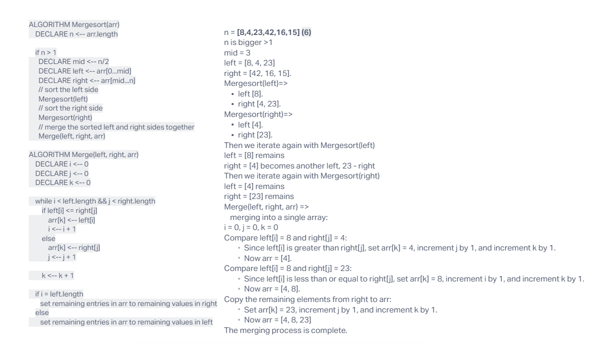

Input: [8, 4, 23, 42, 16, 15]
Visualisation provided by ChatGPT.

                       Mergesort([8, 4, 23, 42, 16, 15])
                              |
            ----------------------------------------------
            |                                            |
Mergesort([8, 4, 23])                           Mergesort([42, 16, 15])
            |                                            |
        ----------------                       -----------------
        |              |                       |               |
Mergesort([8])  Mergesort([4, 23])        Mergesort([42])  Mergesort([16, 15])
        |              |                       |               |
        8      ---------------          ---------------      42
              |               |          |               |
     Mergesort([4])  Mergesort([23])        16     Mergesort([15])
              |               |                       |
              4               23                      15
              ----------------             --------------
                       |                           |
                  ------------------       -------------------
                  |                |       |                 |
        Merge([4], [23], [4, 23])   16    Merge([15], [16], [15, 16])
                  |                           |
                [4, 23]                    [15, 16]
                  |                --------------------
        -------------------        |
        |                 |  Merge([4, 23], [15, 16], [4, 15, 16, 23])
 Merge([8], [4, 23], [4, 8, 23])         |
        |                                [4, 8, 15, 16, 23]
 [4, 8, 23]          ----------------------
        |           |
------------------------
|
Merge([4, 8, 23], [15, 16, 42], [4, 8, 15, 16, 23, 42])
            |
      [4, 8, 15, 16, 23, 42]

