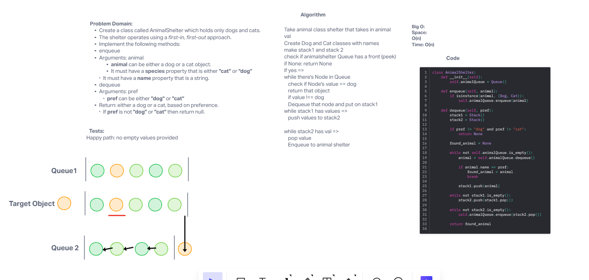

## Authors
Slava Makeev, TA's help

# Challenge Title
stack_queue_animal_shelter

## Approach & Efficiency
BIG O:
Time: O(n)
Space O(n)

# WhiteBoard

## Tests
Requires installed pytest library.
run pytest <filepath> to run tests. Target file is stack_queue_animal_shelter.py inside code challenges
Added additional test to check if the order is maintained.
