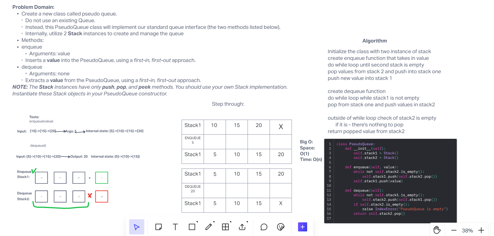

## Authors
Slava Makeev, Anthony Sitsa, Jared Ciccarello, ChatGpt

# Challenge Title
stack_queue_pseudo

## Whiteboard Process

## Approach & Efficiency
BIG O:
Time: O(1)
Space O(n)

## Tests
Requires installed pytest library.
run pytest <filepath> to run tests. Target file is stack_queue_pseudo.py inside code_challenges
