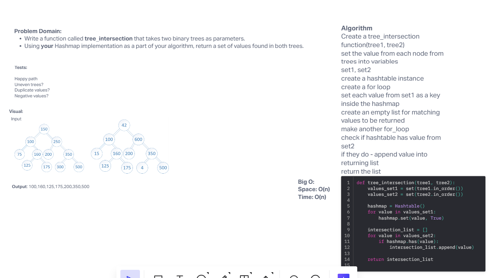

## Authors
Slava Makeev, GPT(helped with fixing my binary tree class)

# Challenge Title
tree_intersection

## Whiteboard Process

## Approach & Efficiency
BIG O:
Time: O(n)
Space O(n)

## Tests
Requires installed pytest library.
run pytest <filepath> to run tests. Target file is tree_breadth_first inside code_challenges
